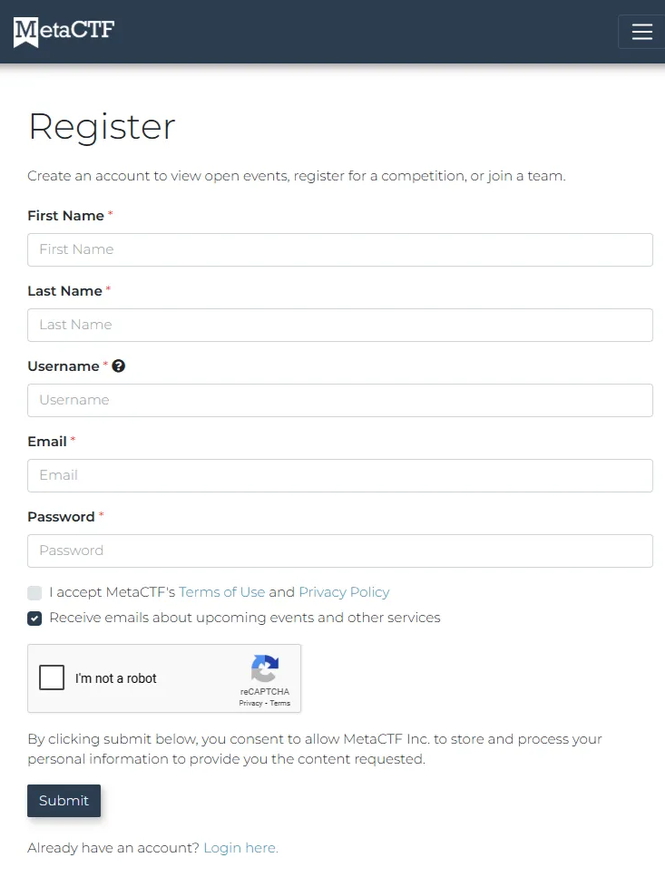
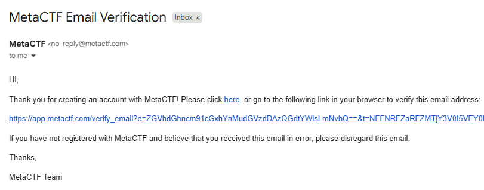

# Lab 0:0 - MetaCTF Setup

---

## Objective

*What will students achieve by the end of this lab?*

- Create MetaCTF account
    - Start CloudLabs Environment

---

## Estimated Time

*Approximate time to complete the lab.*

- Example: 15 minutes

---

# Step-by-Step Instructions

# Step 1: Create MetaCTF account

- Register and create an account at MetaCTF
    - URL: [Create an Account | MetaCTF](https://app.metactf.com/register)
    - Fill out form and select submit button
        
        
        
    - You will be sent an email to verify your email like below
    - To finish registering click on the link
    
    
    

- Verify you can login to MetaCTF with your new account
    - URL: [Login | MetaCTF](https://app.metactf.com/login)
        
        <aside>
        💡
        
        Tip: If you forget your password use the link above and select Forgot my password
        
        </aside>
        

---

# Step 2: Start Cloud Labs Environment

- MetaCTF provides lab environments in addition to providing Capture The Flag (CTF) Competitions. Their lab environment is called Cloud Labs.
- After successfully logged in select Cloud Labs from the top menu and enter your Access Code that is provided  and click on the submit button

- Below will display the lab environment that we will be using during the workshop today
- Click on View & Manage Lab and Start both Virtual Machines (Kali and Windows Server)

- Click on `Start Lab` button. This will take several minutes to build. Once available click on `Start All Machines` to power on the virtual machines. It will take an additional minute or two to be able to VNC and RDP in to each of these VMs.

- Once the virtual machines are available to access connect to them by VNC (Kali) and RDP (Windows). The connections will create a new tab in your browser. Additionally, you will be able to copy and paste between systems.
- It is suggested to use multiple browser tabs/windows  to be able to pivot from the Lab Instructions, Windows VM, Kali VM, Elasticsearch, and MetaCTF.

<aside>
💡

Tip: If copying and paste is not working try using a different browser such as Google Chrome or Microsoft Edge.

</aside>

---

## Next Steps

*What comes after this lab?*

- [Lab 0:1 - Sysmon Install](Lab%200%201%20-%20Sysmon%20Install%2024f86e25cbe581de9883ddaf7cd15ee3.md)

---

## References

- MetaCTF Cloud Labs: https://app.metactf.com/cloud

 © 2026 DEATHGroup Labs LLC. All rights reserved.